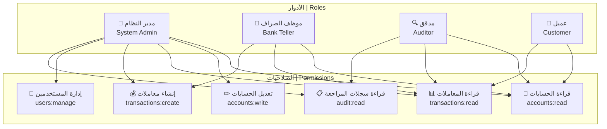
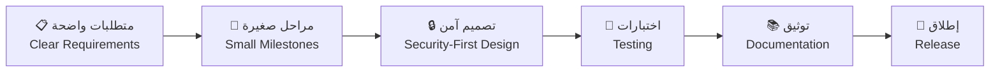

<!--
⭐️ Professional Interactive GitHub Profile README for Nadheer
This README is bilingual (Arabic & English) with interactive elements
-->

<div align="center">

<!-- Animated Typing Header -->


<!-- Profile Views Counter -->


</div>

# <div align="center">مرحباً، أنا نذير 👋 Hi, I'm Nadheer</div>

<div align="center">

### 🎓 طالب هندسة معلوماتية | Computer Engineering Student
### 🏛️ جامعة دمشق | Damascus University
### 🛡️ متخصص في الأمن السيبراني والبرمجة | Cybersecurity & Software Development Specialist

</div>

---

## 🌐 تواصل معي | Connect With Me

<div align="center">

[](mailto:nadheer.dev@gmail.com)
[](https://www.linkedin.com/in/nadheer-ahmed/)
[](https://t.me/nadheer_dev)
[](https://nadheer-portfolio.vercel.app)
[](https://drive.google.com/file/d/your-resume-link)

</div>

---

## 🚀 نظرة عامة | Overview

<div align="center">

```ascii
╔══════════════════════════════════════════════════════════════════════════════╗
║  🎯 الرؤية | Vision: أن أكون مهندس برمجيات وأمن سيبراني قادر على تصميم      ║
║     وبناء أنظمة آمنة ومرنة وفعّالة تُستخدم في المؤسسات المالية والتجارية   ║
║                                                                              ║
║  🎯 Vision: To become a software and cybersecurity engineer capable of      ║
║     designing and building secure, flexible, and efficient systems used     ║
║     in financial and commercial institutions                                ║
╚══════════════════════════════════════════════════════════════════════════════╝
```

</div>

### 🎓 **التعليم والخلفية الأكاديمية | Education & Background**
- 📚 **طالب هندسة معلوماتية** في جامعة دمشق
- 🔐 **متخصص في الأمن السيبراني** مع التركيز على Security by Design
- 🤖 **مهتم بالذكاء الاصطناعي** وتطبيقاته في الأمن والأنظمة المالية
- 💼 **خبرة في أنظمة CRM** وإدارة علاقات العملاء

### 💼 **التركيز الحالي | Current Focus (2025)**
- 🏦 بناء تطبيق مصرفي متقدم مع نظام صلاحيات **RBAC** (Role-Based Access Control)
- 🛡️ تطبيق مبادئ **Security-First Design** في جميع المشاريع
- 📐 استخدام **Clean Architecture** و **Design Patterns**
- 🧪 كتابة **Unit Tests** شاملة ووثائق احترافية

### 🌱 **التعلم المستمر | Currently Learning**
- 🔧 **Advanced C++**: Templates, RAII, Move Semantics, Concurrency
- 🐍 **Python للأمن السيبراني**: Security Tools, Network Programming
- 🐧 **Linux Administration** و **Bash Scripting**
- ☁️ **Cloud Fundamentals** و **DevOps Practices**

### 🤝 **مفتوح للتعاون | Open To**
- 💼 **فرص التدريب** في مجال الأمن السيبراني وهندسة البرمجيات
- 🌍 **المساهمة في المشاريع مفتوحة المصدر**
- 🔬 **مشاريع البحث الأمني** والتطوير التقني
- 👥 **التعاون مع فرق التطوير** المحلية والعالمية

---

## 🧰 المهارات التقنية | Tech Stack

### 💻 **لغات البرمجة | Programming Languages**
<div align="center">


</div>

### 🌐 **تطوير الويب | Web Development**
<div align="center">


</div>

### 🗄️ **قواعد البيانات | Databases**
<div align="center">


</div>

### 🛡️ **الأمن السيبراني والأدوات | Cybersecurity & Tools**
<div align="center">


</div>

### 🔧 **أدوات التطوير | Development Tools**
<div align="center">


</div>

---

## 📊 مصفوفة المهارات | Skills Matrix

<div align="center">

| **المهارة \| Skill** | **المستوى \| Level** | **التقدم \| Progress** |
|:---:|:---:|:---:|
| **C++ (OOP, STL, Patterns)** | متقدم \| Advanced |  |
| **Python (Security Tools)** | جيد جداً \| Very Good |  |
| **Data Structures & Algorithms** | جيد \| Good |  |
| **Cybersecurity (Linux, OWASP)** | متوسط+ \| Intermediate+ |  |
| **Databases (SQL, Design)** | متوسط \| Intermediate |  |
| **Web Development (Full Stack)** | متوسط \| Intermediate |  |

</div>

---

## 🏗️ المشاريع المميزة | Featured Projects

<div align="center">

### 🏦 **SecureBank** - تطبيق مصرفي آمن
[](https://github.com/nadheer/SecureBank)
[](https://securebank-demo.vercel.app)

**الوصف**: تطبيق مصرفي متقدم مع نظام صلاحيات RBAC، سجلات المراجعة، واختبارات شاملة  
**التقنيات**: C++ (Core), SQLite, CLI/REST API  
**الميزات**: Role-Based Access Control, Audit Logs, Unit Testing, Clean Architecture

---

### 🔍 **NetScan** - ماسح الشبكات الأمني
[](https://github.com/nadheer/NetScan)

**الوصف**: أداة خفيفة لمسح الشبكات وجمع معلومات البانر للتعلم الأمني  
**التقنيات**: Python, Sockets, argparse, Threading  
**الميزات**: Port Scanning, Banner Grabbing, Multi-threading, Security Analysis

---

### 💼 **CRM-Lite** - نظام إدارة العملاء
[](https://github.com/nadheer/CRM-Lite)

**الوصف**: نظام CRM بسيط لإدارة العملاء والصفقات والمراحل  
**التقنيات**: Node.js, Express, SQLite, REST API  
**الميزات**: Contact Management, Deal Tracking, Stage Pipeline, RESTful API

---

### 🧮 **AlgoPlayground** - ساحة الخوارزميات
[](https://github.com/nadheer/AlgoPlayground)

**الوصف**: مساحة لممارسة هياكل البيانات والخوارزميات مع قوالب نظيفة  
**التقنيات**: C++, Templates, STL, Benchmarking  
**الميزات**: Algorithm Templates, Performance Benchmarks, Clean Code Examples

</div>

---

## 🔐 نظام الصلاحيات RBAC | RBAC System Architecture

<div align="center">



</div>

---

## 📈 إحصائيات GitHub | GitHub Analytics

<div align="center">

<!-- GitHub Stats Cards -->


<!-- GitHub Streak Stats -->


<!-- Activity Graph -->


<!-- Contribution Snake -->


</div>

---

## 🗺️ خريطة الطريق 2025 | 2025 Roadmap

<div align="center">

### 🎯 **الأهداف التقنية | Technical Goals**

</div>

- [ ] 🔧 **إتقان C++ المتقدم**: Templates, RAII, Move Semantics, Concurrency
- [ ] 🏦 **إكمال SecureBank v1.0**: RBAC, Tests, Documentation, Releases
- [ ] ✍️ **كتابة 5 مقالات تقنية**: C++ OOP, RBAC Design, Security Basics
- [ ] 🎓 **الحصول على شهادات**: Google IT Support, CompTIA Security+ Prep
- [ ] 🌍 **المساهمة في مشروعين مفتوحي المصدر**: Good First Issues
- [ ] 🐍 **تطوير أدوات أمنية بـ Python**: Network Security Tools
- [ ] ☁️ **تعلم أساسيات الحوسبة السحابية**: AWS/Azure Fundamentals
- [ ] 🤖 **تطبيق الذكاء الاصطناعي في الأمن**: ML for Cybersecurity

<div align="center">

### 📚 **الأهداف التعليمية | Educational Goals**

</div>

- [ ] 📖 **إكمال دورة IBM AI** مع جامعة شقراء
- [ ] 🗣️ **تحسين اللغة الإنجليزية**: Professional Communication
- [ ] 🔐 **دراسة الأمن السيبراني**: Ethical Hacking, Penetration Testing
- [ ] 📊 **تعلم تحليل البيانات**: Data Science for Security
- [ ] 🏗️ **دراسة معمارية الأنظمة**: System Design, Microservices

---

## 🎓 الشهادات والدورات | Certifications & Courses

<div align="center">

| **الدورة/الشهادة \| Course/Certification** | **المؤسسة \| Institution** | **الحالة \| Status** |
|:---:|:---:|:---:|
| 🤖 **دورة الذكاء الاصطناعي** | IBM × جامعة شقراء | 🔄 قيد التقدم \| In Progress |
| 🔧 **البرمجة كائنية التوجه المتقدمة في C++** | تعلم ذاتي \| Self-Study | 🔄 مستمر \| Ongoing |
| 🗣️ **احتراف التواصل باللغة الإنجليزية** | Coursera | 🔄 قيد التقدم \| In Progress |
| 🔐 **أساسيات الأمن السيبراني** | تدريب ذاتي \| Self-Training | 🔄 مستمر \| Ongoing |
| 🐧 **إدارة أنظمة Linux** | تعلم ذاتي \| Self-Study | 🔄 مستمر \| Ongoing |

</div>

---

## 💭 فلسفة العمل | Work Philosophy

<div align="center">

> **"أؤمن أن التكنولوجيا ليست مجرد أدوات، بل امتداد لقدراتنا كبشر لتوسيع إمكانياتنا وتحقيق قيمة حقيقية"**
> 
> *"I believe that technology is not just tools, but an extension of our human capabilities to expand our potential and create real value"*

</div>

### 🎯 **مبادئ العمل | Work Principles**

- **🔒 الأمان أولاً**: Security by Design في كل مشروع
- **📋 التنظيم والوضوح**: تقسيم المهام، توثيق واضح، اختبارات شاملة
- **🤝 روح الفريق**: التعاون والتعلم المشترك
- **📈 التحسين المستمر**: التعلم من الأخطاء والتطوير المستمر
- **🌍 المساهمة المجتمعية**: دعم المشاريع مفتوحة المصدر

### 🛠️ **أسلوب التطوير | Development Style**

```yaml
Code_Quality:
  - Clean Architecture
  - SOLID Principles
  - Design Patterns
  - Unit Testing

Security_First:
  - Input Validation
  - Authentication & Authorization
  - Secure Coding Practices
  - Regular Security Audits

Collaboration:
  - GitHub Issues & PRs
  - Code Reviews
  - Documentation
  - Team Communication
```

---

## 🌍 اللغات | Languages

<div align="center">

| **اللغة \| Language** | **المستوى \| Level** | **الاستخدام \| Usage** |
|:---:|:---:|:---:|
| 🇸🇦 **العربية** | اللغة الأم \| Native | التواصل اليومي والتوثيق |
| 🇺🇸 **الإنجليزية** | جيد جداً \| Very Good | البرمجة والمصادر التقنية |
| 🇩🇪 **الألمانية** | مبتدئ \| Beginner | تعلم مستقبلي |

</div>

---

## ✍️ آخر المقالات | Latest Articles

<div align="center">

| **العنوان \| Title** | **المنصة \| Platform** | **التاريخ \| Date** |
|:---:|:---:|:---:|
| 🔐 **أساسيات RBAC في الأنظمة المصرفية** | LinkedIn | قريباً \| Coming Soon |
| 🔧 **Clean Architecture في C++** | Medium | قريباً \| Coming Soon |
| 🛡️ **Security by Design: دليل المطور** | Dev.to | قريباً \| Coming Soon |

</div>

---

## 🤝 كيفية التعاون معي | How to Work With Me

<div align="center">



</div>

### 📞 **طرق التواصل المفضلة | Preferred Communication**

- **📧 البريد الإلكتروني**: للمراسلات الرسمية والمشاريع
- **💬 تيليجرام**: للتواصل السريع والاستفسارات
- **💼 لينكدإن**: للتواصل المهني والشبكات
- **🐙 GitHub**: للتعاون التقني ومراجعة الكود

### ⏰ **أوقات العمل | Working Hours**

- **🌅 الصباح**: 9:00 AM - 12:00 PM (أفضل وقت للبرمجة)
- **🌆 المساء**: 6:00 PM - 10:00 PM (المراجعة والتعلم)
- **📅 أيام الأسبوع**: الأحد - الخميس
- **⚡ الاستجابة**: خلال 24 ساعة عادة

---

## 📊 إحصائيات إضافية | Additional Stats

<div align="center">

<!-- WakaTime Stats -->


<!-- Profile Trophy -->


</div>

---

## 🎨 مشاريع إبداعية | Creative Projects

<div align="center">

### 🌟 **مشاريع قادمة | Upcoming Projects**

| **المشروع \| Project** | **الوصف \| Description** | **التقنيات \| Tech** | **الحالة \| Status** |
|:---:|:---:|:---:|:---:|
| 🏦 **SecureBank v2.0** | إضافة واجهة ويب وAPI متقدم | React + C++ Backend | 📋 التخطيط |
| 🔍 **VulnScanner** | أداة فحص الثغرات الأمنية | Python + Machine Learning | 💡 فكرة |
| 📱 **CRM Mobile App** | تطبيق جوال لنظام CRM | React Native | 💡 فكرة |
| 🤖 **AI Security Bot** | بوت ذكي لمراقبة الأمان | Python + NLP | 💡 فكرة |

</div>

---

<div align="center">

## 📫 تواصل معي | Get In Touch

**هل لديك مشروع مثير للاهتمام؟ أو تريد التعاون في مجال الأمن السيبراني؟**  
**Do you have an interesting project? Or want to collaborate in cybersecurity?**

[](mailto:nadheer.dev@gmail.com)
[](https://www.linkedin.com/in/nadheer-ahmed/)
[](https://t.me/nadheer_dev)

---

### 🌟 **"الكود النظيف هو كود يمكن قراءته وفهمه وتطويره بسهولة"**
### 🌟 **"Clean code is code that can be easily read, understood, and maintained"**

---


**آخر تحديث | Last Updated**: `2025-01-09`

</div>

---

<details>
<summary><b>🔧 دليل الإعداد السريع | Quick Setup Guide</b></summary>

### خطوات إنشاء البروفايل | Profile Setup Steps

1. **إنشاء مستودع جديد**:
   ```bash
   # أنشئ مستودع باسم username نفس اسم المستخدم
   # Create repository with same name as your username
   ```

2. **إضافة الملف**:
   ```bash
   # أضف هذا الملف كـ README.md
   # Add this file as README.md
   ```

3. **تخصيص المعلومات**:
   ```bash
   # بدّل المعلومات الشخصية
   # Replace personal information
   ```

4. **تفعيل الميزات التفاعلية**:
   ```bash
   # تأكد من أن المستودع عام (Public)
   # Make sure repository is public
   ```

### 🎨 **تخصيص الألوان | Color Customization**

```css
/* الألوان المستخدمة | Used Colors */
Primary: #58A6FF (GitHub Blue)
Secondary: #FF6B6B (Coral Red)
Background: #0D1117 (GitHub Dark)
Text: #C9D1D9 (Light Gray)
Accent: #00FF00 (Success Green)
```

### 📊 **إضافة إحصائيات مخصصة | Custom Stats**

```markdown
<!-- استبدل 'nadheer' باسم المستخدم الخاص بك -->
<!-- Replace 'nadheer' with your username -->


```

</details>

---

<div align="center">

**🚀 مستعد لبناء المستقبل معاً | Ready to Build the Future Together 🚀**

[](https://github.com/nadheer)
[](https://github.com/nadheer)

</div>


